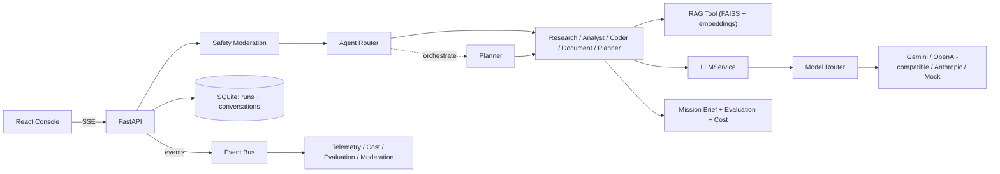

# Aegis

**A crisis decision copilot.** Describe a situation — a supply-chain disruption, a market
event, a cyber incident, a natural disaster — and Aegis returns a structured decision brief
(risk score, top alerts, recommended actions, supporting evidence) instead of a raw chatbot
reply, with the entire pipeline streamed live as it executes.

[](https://github.com/goeldaksh06/Aegis/actions/workflows/ci.yml)

---

## What it does

Type a scenario (or click one of the built-in examples) and Aegis:

1. **Routes** the request to the right agent — Research, Analyst, Coder, Document, or
   Planner — based on the task, or lets you pick one explicitly.
2. **Screens** the prompt for safety issues (prompt injection, jailbreak patterns) before
   anything else runs; a blocked request never reaches the LLM.
3. **Retrieves** supporting context via a FAISS-backed RAG pipeline, grounded in real
   reference documents across four domains (supply chain, cybersecurity, market risk,
   natural disaster), with a relevance threshold so irrelevant results are filtered out.
4. **Calls** the right LLM through a provider-agnostic layer — Gemini, OpenAI-compatible
   gateways, Anthropic, or a free deterministic mock provider for local dev/CI.
5. **Returns** a structured mission brief — risk score, top alerts, recommended actions,
   evidence — computed server-side, plus a cost estimate and a quality/groundedness score
   for the response.
6. **Persists** every run to SQLite, so history survives a refresh or backend restart, and
   optionally threads multi-turn conversations with real memory recall.
7. **Streams the whole pipeline live** via Server-Sent Events — you can watch routing,
   retrieval, generation, evaluation, and persistence happen in real time, not just see a
   final result.

On top of single-agent runs, an **orchestration mode** lets a Planner agent decompose a
task and dispatch sub-steps to other agents automatically — real agent-to-agent handoff,
not just routing.

The anonymous demo works with zero login — but signing in gets you a personal, isolated
mission history with real per-agent observability: exact duration, tokens, and cost for
every agent actually dispatched in a mission (not estimated after the fact — persisted from
the same checkpoints the live trace already streams).

## Architecture at a glance



## Tech stack

- **Backend:** FastAPI, Pydantic v2, SQLAlchemy (async) + aiosqlite, FAISS, sentence-transformers,
  PyJWT + bcrypt for authentication
- **LLM providers:** Google Gemini, OpenAI-compatible gateways, Anthropic, and a deterministic
  mock provider for free local dev/CI
- **Frontend:** React + TypeScript + Vite, Server-Sent Events for live pipeline streaming

## Running it

Free/no-cost mode (no API keys required) — set in `backend/.env`:
```
MODEL_PROVIDER=mock
MODEL_NAME=mock-default
```

Backend:
```powershell
cd backend
.\.venv\Scripts\python.exe -m uvicorn app.main:app --host 127.0.0.1 --port 8000
```

Frontend:
```powershell
cd frontend
npm install
npm run dev -- --host 127.0.0.1 --port 5173
```

Then open `http://127.0.0.1:5173` and point the "Backend target" field at
`http://127.0.0.1:8000`.

For a live provider instead of mock, set `MODEL_PROVIDER` and the matching API key in
`backend/.env` (e.g. `OPENAI_API_KEY` + `OPENAI_BASE_URL` for an OpenAI-compatible gateway,
or `GEMINI_API_KEY` for Gemini).
